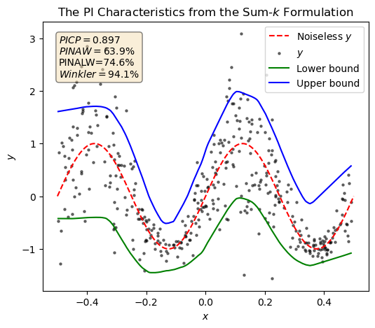

# Neural Network-Based Prediction Interval Estimation with Large Width Penalization for Renewable Energy Forecasting and System Applications
This GitHub repository contains the code used for the experiments described in the article "Neural Network-Based Prediction Interval Estimation with Large Width Penalization for Renewable Energy Forecasting and System Applications."
## Citation
```
@misc{amnuaypongsa2024largewidthpenalizationneural,
      title={Large width penalization for neural network-based prediction interval estimation}, 
      author={Worachit Amnuaypongsa and Jitkomut Songsiri},
      year={2024},
      eprint={2411.19181},
      archivePrefix={arXiv},
      primaryClass={cs.LG},
      url={https://arxiv.org/abs/2411.19181}, 
}
```
Contact: `worachitam@gmail.com`
## Abstract
Increasing the penetration of renewable energy introduces significant uncertainty into power systems. Probabilistic forecasting, which quantifies this uncertainty through prediction intervals (PIs), is essential for guiding a generation operating reserve preparation. The amount of standby generation resources is directly reflected by a PI width and typically focuses on the worst-case scenario arising with large PI widths under extreme conditions. This paper aims to reduce the large PI widths by proposing a new PI-based loss function that utilizes the sum of the K-largest element functions to impose greater penalties on larger PI widths in developing a renewable energy forecasting model. The proposed methodology can identify and reduce large PI widths during the model training process while ensuring PI's reliability. The loss function is compatible with gradient-based algorithms, allowing for further integration with state-of-the-art neural networks and recent deep learning techniques. Experiments on synthetic and solar irradiance forecasting datasets utilizing ANN and LSTM models showcase our approach's effectiveness in attaining narrower PIs while maintaining prediction accuracy. A cost analysis of solar power reserve demonstrates that our method yields reduced reserve over-allocation and lower total costs for provision and deficit penalties under high uncertainty. This is due to an improved PI's lower bound, which better captures actual generation, thereby decreasing lost load penalties. Furthermore, in robust energy management, the net electricity cost range assessed using PI information exhibits the narrowest variation compared to benchmarked methods due to the conservatism reduction in PI widths of net load forecasts.

## Formulation description
The proposed formulation is called the Sum-k formulation, which can be shown as
```math
\begin{equation}
	\mathcal{L}_{\text{sum}-k}(\theta) = \max(0, (1-\delta) - \text{PICP}(\theta)) + \gamma \frac{1}{R_{\text{quantile}}} \left [ \frac{1}{K} \sum_{i=1}^{K} |w(\theta)|_{[i]}  + \frac{\lambda}{N-K} \sum_{i=K+1}^{N} |w(\theta)|_{[i]} \right ],
\end{equation}
```
where $\vert w \vert_{[i]}$ is the $i^{\mathrm{th}}$ largest absolute PI width element, with $\vert w \vert_{[1]}  \geq \vert w \vert_{[2]}  \geq \cdots  \geq  \vert w \vert_{[N]} $.

An example of the PI characteristics of the Sum-k formulation on synthetic data is illustrated below.
<p align="center">
  
</p>

## Quick start
A simple example of the PI construction utilizing our formulation is presented in [**demo.ipynb**](./demo.ipynb).

## Repository
This repository is structured as follows:
```
|-- utils
|   |-- formulations.py
|   |-- networks.py
|   |-- trainer.py
|-- experiment
|   |-- pi_characteristics
|   |-- benchmark
|   |-- input_data
|   |-- hyperparameter
|-- paper_figure
|   |-- visualization.ipynb
|   |-- saved_figures
|-- demo.ipynb
```
- `utils` folder consists of `.py` files that define the loss function, neural network architecture, and training algorithms.
	- `formulation.py` consists of all loss functions used in this study, including our formulation.
	- `networks.py` consists of a neural network model structure
	- `trainer.py` includes a training algorithm, evaluation metrics calculation, and result plots generation.
- `experiment` includes all experiment corresponding codes and datasets utilized in Section 5 of the article. The experiment is divided into two experiments:
	- [**pi_characteristics**](./experiment/pi_characteristics) explores the trade-off curve between PICP and PI width as described in Section 4.3.1 and the results presented in Section 5 of the article.
 	- [**benchmark**](./experiment/benchmark) compares the performance metrics and PI width histogram from every method as described in Section 4.3.2, with the results presented in Section 5 of the article.
- The `paper_figure` folder contains the figures used in this article along with the code for generating them ([**visualization.ipynb**](./paper_figure/visualization.ipynb)).
